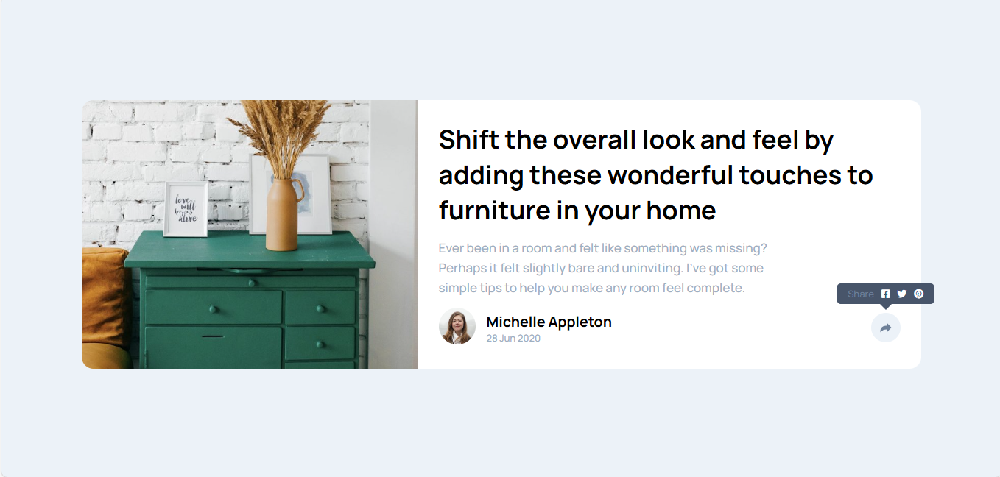

# Frontend Mentor - Article preview component

This is a solution to the [Article preview component
](https://www.frontendmentor.io/challenges/article-preview-component-dYBN_pYFT). Frontend Mentor challenges help you improve your coding skills by building realistic projects.

## Table of contents

- [Overview](#overview)
  - [The challenge](#the-challenge)
  - [Screenshot](#screenshot)
  - [Links](#links)
  - [Installation](#Installation)
  - [Usage](#Usage)
- [My process](#my-process)
  - [Built with](#built-with)
  - [What I learned](#what-i-learned)
  - [Continued development](#continued-development)
- [Author](#author)
- [Acknowledgments](#Acknowledgments)

## Overview

### The challenge

Practice your layout skills with this article preview component. There's lots of fun to be had playing around with animations for the sharing icons as well.

Your users should be able to:

- See the social media share links when they click the share icon
- View the optimal layout for each page depending on their device's screen size
- See hover states for all interactive elements on the page

### Screenshot



### Links

- Solution URL: [here](https://github.com/olahasan/HTML_CSS_AND_J.S_Frontend-Mentor_NEWBIE-Article-preview-component)

- Live Site URL: [here](https://olahasan.github.io/HTML_CSS_AND_J.S_Frontend-Mentor_NEWBIE-Article-preview-component/)

## Installation

To get a local copy up and running, follow these simple steps:

1. **Clone the repository**:

   ```sh
   git clone https://github.com/your-username/your-repo-name.git
   ```

2. **Navigate to the project directory**:

   ```sh
   cd your-repo-name
   ```

3. **Open the project in your preferred code editor**.

## Usage

To use the components in your project, you can simply copy the HTML, CSS, and JavaScript files into your project directory. Make sure to link the CSS and JS files correctly in your HTML.

## My process

### Built with

- Responsive design
- Interactive elements
- Clean and modern UI
- Easy to integrate into other projects

### What I Learned

In this project, I practiced using Flexbox for layout and CSS custom properties for better maintainability. I also focused on making the component responsive and accessible.

### Continued Development

I plan to continue improving my skills in html,css and javascript

### Author

Frontend Mentor - @olahasan<br>
GitHub - @olahasan

### Acknowledgments

I would like to thank the **Frontend Mentor** for providing this challenge and to the community for their support and feedback
